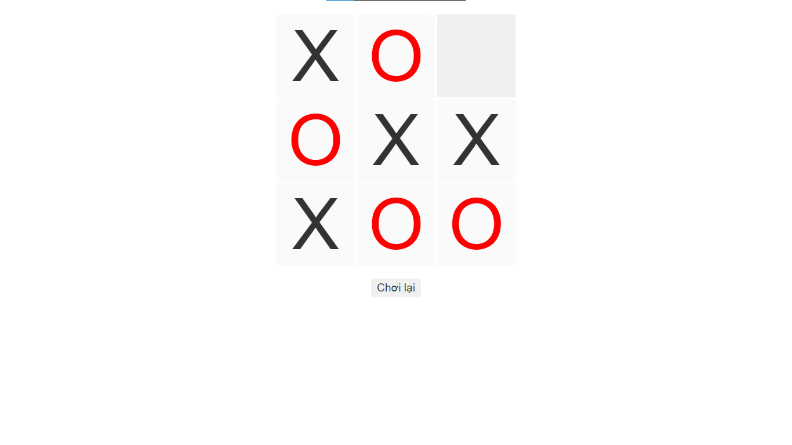

<!--
Hey, thanks for using the awesome-readme-template template.
If you have any enhancements, then fork this project and create a pull request
or just open an issue with the label "enhancement".

Don't forget to give this project a star for additional support ;)
Maybe you can mention me or this repo in the acknowledgements too
-->
<div align="center">

  
  <h1>Cyber Tic Tac Toe Game</h1>
  
  <p>
    This is a simple Tic Tac Toe game built using ReactJS. It allows two players to take turns and compete against each other in the classic Tic Tac Toe board. 
  </p>
  
  
<!-- Badges -->
<p>
<a href="https://github.com/luyenhaidangit/cyber-tic-tac-toe-game/graphs/contributors">
  
</a>
<a href="https://github.com/luyenhaidangit/cyber-tic-tac-toe-game/commits/master">
  
</a>
<a href="https://github.com/luyenhaidangit/cyber-tic-tac-toe-game/blob/master/LICENSE">
  
</a>
</p>
   
<h4>
  <a href="https://github.com/luyenhaidangit/cyber-tic-tac-toe-game/">Documentation</a>
  <span> · </span>
  <a href="https://github.com/luyenhaidangit/cyber-tic-tac-toe-game/issues/">Report Bug</a>
</h4>

</div>

<br />

<!-- Table of Contents -->

# :notebook_with_decorative_cover: Table of Contents

-   [About the Project](#star2-about-the-project)
    -   [Screenshots](#camera-screenshots)
    -   [Tech Stack](#space_invader-tech-stack)
    -   [Features](#dart-features)
-   [Getting Started](#toolbox-getting-started)
    -   [Prerequisites](#bangbang-prerequisites)
    -   [Installation](#gear-installation)
    -   [Running Tests](#test_tube-running-tests)
    -   [Run Locally](#running-run-locally)
    -   [Deployment](#triangular_flag_on_post-deployment)
-   [License](#warning-license)
-   [Contact](#handshake-contact)

<!-- About the Project -->

## :star2: About the Project

<!-- Screenshots -->

### :camera: Screenshots

<div align="center"> 
  
</div>

<!-- TechStack -->

### :space_invader: Tech Stack

<a href="https://react.dev/">React.js</a>

<!-- Features -->

### :dart: Features

-   Play 3x3 Tic-Tac-Toe: Users can enjoy playing the classic Tic-Tac-Toe game on a 3x3 grid.
-   Replay Option: After a game is over, users have the option to play again without having to reload the page or start a new game manually.

<!-- Getting Started -->

## :toolbox: Getting Started

<!-- Prerequisites -->

### :bangbang: Prerequisites

Before getting started, ensure you have:

-   **Node.js**: Install Node.js from https://nodejs.org/
-   **npm**: npm comes bundled with Node.js.

<!-- Installation -->

### :gear: Installation

Clone the repository and navigate to the project directory:

```bash
  git clone https://github.com/luyenhaidangit/cyber-tic-tac-toe-game.git
```

<!-- Running Tests -->

### :test_tube: Running Tests

To run tests, run the following command

```bash
  npm test
```

<!-- Run Locally -->

### :running: Run Locally

Clone the repository and navigate to the project directory:

```bash
  git clone https://github.com/luyenhaidangit/cyber-tic-tac-toe-game.git
```

Go to the project directory

```bash
  cd tic-tac-toe-game
```

Install dependencies

```bash
  npm install
```

Start the server

```bash
  npm start
```

<!-- Deployment -->

### :triangular_flag_on_post: Deployment

To deploy this project run

```bash
  npm deploy
```

<!-- License -->

## :warning: License

Distributed under the no License. See LICENSE.txt for more information.

<!-- Contact -->

## :handshake: Contact

Luyện Hải Đăng - [@facebook](https://www.facebook.com/luyenhaidangit) - luyenhaidangit@gmail.com

Project Link: [https://github.com/luyenhaidangit/cyber-tic-tac-toe-game](https://github.com/luyenhaidangit/cyber-tic-tac-toe-game)
